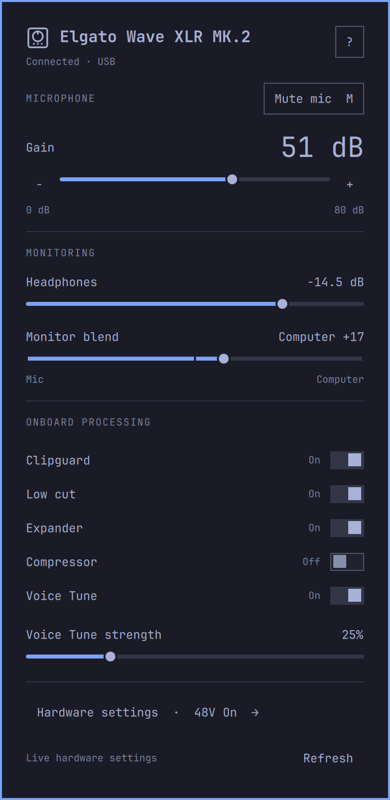

# Elgato Wave XLR MK.2 for Omarchy


Linux USB audio interface controls for **Elgato Wave XLR MK.2** (also written
Wave XLR MK2): microphone gain, mute, headphones, monitor mix and onboard DSP,
in a native Omarchy shell plugin. This supports the MK.2, not the original Wave
XLR, Wave XLR Pro or Stream Deck XLR Dock. Click the outlined
Wave XLR device icon beside the stock audio control. The icon follows the bar
color, dims on loss of connection, and uses the theme's urgent color plus a slash
when muted. The panel inherits the live Omarchy theme, font, spacing and scale.

Built with native Omarchy controls: prominent gain, monitoring, aligned onboard-effect
switches, and a separate hardware-settings page. Some native details (square
switches, borders, sizing) intentionally follow the shell rather than the mockup.



## Controls

- Actual preamp gain 0–80 dB, hardware capture mute, headphone attenuation
  −60 to 0 dB. Gain keys step 1 dB; headphone keys step 0.25 dB.
- Vendor USB controls: Clipguard, low cut, expander, compressor, Voice Tune and
  strength, direct monitor blend (0 mic, 100 center, 200 computer), low impedance,
  and 48V phantom power with explicit confirmation. Cancel receives focus first.
- Wheel steps headphones by 1 dB; Shift-wheel by 0.25 dB. Tab/Shift-Tab navigate,
  arrows adjust sliders, M toggles mute, Escape cancels/backs out/closes.
- Hardware settings contains the explicit “Use mic + headphones as defaults”
  action. Loading the plugin changes neither defaults nor hardware settings.
- Help explains controls and keyboard behavior. Values are settings, not meters.
- EQ, LED customization, Auto Gain, gain-lock policy, firmware upgrades,
  Wave Link application mixing and VST hosting are not implemented.

## Responsive device state

A single persistent Rust worker owns the vendor USB interface. The panel uses
newline-delimited JSON on stdin/stdout, rather than spawning a process per poll.
It reads every 50 ms while open and 500 ms while closed, sending changed state
plus a liveness frame at least once per second while hardware is present. Incoming
reads never disable sliders. Local drags display immediately, coalesce writes
at 50 ms, and flush the final release. Pending IDs protect newer edits from older
acknowledgments. Device-side changes briefly highlight the affected number.
Native Omarchy slider thumbs retain 140 ms easing; numeric values update directly.

Stale values are explicitly marked and mutations disabled. A stalled worker is
restarted after a 3-second watchdog (12 seconds during the bounded defaults
operation); reconnect uses backoff, without blindly replaying writes. The ALSA
fallback is available only when the device is present but USB permission is absent.
Only one worker can own the lock; the standalone CLI fails fast while it runs.
The current deployment is a single-monitor bar; multi-instance ownership is not
implemented and must be addressed before enabling duplicate bar instances.

Background efficiency (v1.2.1): while connected, the worker blocks until the next
500 ms device check or 1-second heartbeat; there is no extra 100 ms wake loop.
The UI uses one-shot watchdog/highlight timers, ignores identical state for
control bindings, and suppresses writes when the snapped value has not changed.
When physically disconnected, a compact panel replaces the controls. One initial
sysfs inventory and passive udev notifications track attachment; there are no USB
open attempts, control reads, ALSA subprocesses, or periodic inventory scans while
absent. After announcing absence, the worker blocks indefinitely on its device
notification socket and stdin: no heartbeat or timer wakeups. The panel stops its
watchdog while idle and absent, but still detects process exits and starts a
bounded timeout for each user command. A device-arrival notice restarts the UI
watchdog before the worker opens USB. Controls return after attachment; reconnect backoff applies only while hardware is present
but unavailable. libusb is linked directly. Permission-only
ALSA fallback reads all basic controls with one process, every 2 seconds while
closed or 500 ms while open. The normal USB path starts no polling subprocesses.

Read-only diagnostics while the bar is running:

```
omarchy-shell sudonim.wave-xlr-status status
```

The standalone `libexec/wave-xlr-control` still works with the plugin disabled and no
worker holding the lock. Do not run another vendor-control app concurrently.

## Protocol and safety

Mapping reference: [OpenXLR WaveXlrMk2Device.cs](https://github.com/emaspa/openxlr/blob/main/src/OpenXLR.Core/Devices/WaveXlrMk2Device.cs).
Vendor/product 0fd9:00b6, interface 3, bank 0x0203, blocks 1/4/5 (6/38/2 bytes).
The Rust/libusb worker claims only the vendor interface and never detaches the
audio driver. Writes read the current block, modify only the chosen field,
preserve unknown bytes, and confirm the selected value by readback. Unexpected
lengths/ranges fail closed. These are community protocol mappings, not an Elgato
Linux API. Register readback confirms state, not acoustic processing quality.

## Installation

Runtime dependencies: libusb, systemd/libudev, ALSA tools, PipeWire/WirePlumber, and the Omarchy
Quickshell shell. Build dependencies: Rust/Cargo, a C compiler, and pkg-config.
Python is not required for installation, runtime, or tests.

Install source, compile the worker once, then enable the plugin:

```bash
omarchy pkg add rust base-devel pkgconf libusb alsa-utils
omarchy plugin add https://github.com/sud0n1m/omarchy-wave-xlr-mk2
~/.config/omarchy/plugins/sudonim.wave-xlr/build-worker
omarchy plugin enable sudonim.wave-xlr
```

`build-worker` runs `cargo build --release --locked` and installs a native worker
in the plugin's `libexec/` directory. Build output is cached outside the plugin
in `~/.cache/omarchy-wave-xlr-mk2/build` (respects `XDG_CACHE_HOME`). There is no
runtime compilation, Python fallback, downloaded executable, or background cargo
process. Cargo downloads the source dependencies recorded in `Cargo.lock` during
the explicit build. No root privileges are needed to compile.

After updating the source, rebuild and restart the shell:

```bash
omarchy plugin update sudonim.wave-xlr
~/.config/omarchy/plugins/sudonim.wave-xlr/build-worker
omarchy restart shell
```

### Manual USB setup

Basic gain, mute and headphone controls can use ALSA without vendor USB access.
For onboard DSP and the full control panel, use the ownership-checking setup
command after building the worker. These are explicit administrator actions;
the plugin never runs them automatically:

```bash
sudo ~/.config/omarchy/plugins/sudonim.wave-xlr/libexec/wave-xlr-control --install-udev-rule
sudo udevadm control --reload-rules
```

Reconnect the Mk.2. The rule grants the active local user access only to this
product. The helper creates `70-sudonim-wave-xlr-mk2.rules` under
`/etc/udev/rules.d/` using an atomic operation that cannot overwrite an existing
path. A root-only `.sudonim-wave-xlr-mk2/` directory beside it records ownership
with a hard link to the installed inode. Repeated setup accepts only that exact
inode with unchanged contents, owner and permissions. Existing files (even with
identical contents), symlinks, modified rules and replacements are preserved and
reported as conflicts. The helper does not claim USB or contact the device.

**Upgrading from 1.2.1 or earlier:** the old `70-wave-xlr-mk2.rules` path is left
untouched, since ownership cannot be established. An existing rule can continue
providing access. Do not delete or overwrite it merely because of its filename;
review its provenance or use its owning package/tool to manage it.

Tested with Omarchy's Quickshell-based shell; this is not a Waybar
module. The plugin claims only the vendor control interface; the kernel keeps the audio streaming interface.

Optional placement and connection check:

```bash
omarchy bar put sudonim.wave-xlr --before omarchy.audio
omarchy restart shell
omarchy-shell sudonim.wave-xlr-status status
```

The explicit shell restart ensures no cached QML/IPC instance remains from an
older version. Status should report `usb: true`, `stale: false`, one running
worker, and no error. The worker is owned by the shell; no systemd unit is needed.
Do not install the Mk.1 WirePlumber workaround for this Mk.2.

## Removal

If you installed this version's USB rule and no other Wave XLR MK.2 tool needs
it, remove it **before** removing the plugin (the native helper is needed):

```bash
sudo ~/.config/omarchy/plugins/sudonim.wave-xlr/libexec/wave-xlr-control --remove-udev-rule
sudo udevadm control --reload-rules
```

Removal requires the original inode plus matching receipt, contents, owner and
permissions. It refuses to delete an unowned, modified, replaced or symlinked
rule. Do not bypass a refusal with `rm`; leave the rule for its owner to review.
The empty private ownership directory and setup lock remain for safe concurrent
setup; neither grants device access. The old generic rule is never removed.

```bash
omarchy plugin remove sudonim.wave-xlr
```

Reconnect the device to apply a permission change. Removing the plugin leaves
hardware settings and any explicitly selected PipeWire defaults unchanged.

## Verification

```bash
cargo test --locked
cargo clippy --locked --all-targets -- -D warnings
# Optional UI integration tests: Node.js + Omarchy/Quickshell + QtTest required
cargo test --locked --test panel -- --ignored --nocapture
```

The Rust tests use fake devices and clocks for protocol preservation, bounds,
readback, reconnects, ALSA fallback, stale-state handling, and deadlines. Framing
and subprocess tests cover oversized/invalid input, timeout cleanup, and output
larger than a pipe buffer. These tests never write to real hardware.
Eight setup tests cover ownership, collisions (including identical files),
modified/replaced rules, symlinks, permissions, concurrent setup and interrupted
installation, using isolated temporary directories without administrator access.

The optional UI tests are run by Rust and exercise JavaScript functions and slider
components extracted from the actual `Panel.qml`. The slider tests use an isolated
offscreen shell and never start the device worker. These two tests are explicitly
ignored by default so the worker suite can run without desktop dependencies.

The original Python implementation and its tests are available in Git history.
The current source and test runners contain no Python. Historical Python
measurements are in [the efficiency review](docs/efficiency.md). See
[the Rust migration report](docs/rust-migration.md) for current verification and
measurement limits. [Event-only idle verification](docs/event-only-idle.md) covers
v1.2.1, which removes the unplugged heartbeat. Physical-knob-to-screen latency and acoustic DSP quality
have not been measured.

## License and acknowledgments

[MIT](LICENSE). Thanks to [OpenXLR](https://github.com/emaspa/openxlr) for documenting
the Wave XLR MK.2 USB protocol. This project implements those hardware mappings
in its own control worker and does not bundle or execute OpenXLR.
The device-outline icon is original artwork for this community plugin, shared
by the bar and panel heading. This project is not affiliated with Elgato.
