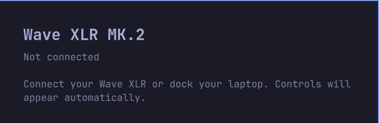

# Rust worker — v1.2.0

Historical migration measurements. [v1.2.1 removes the unplugged heartbeat](event-only-idle.md).

The production control worker is Rust. While undocked, the UI shows a compact
“Not connected” panel and hides hardware controls. A passive udev monitor starts
before the initial sysfs inventory. No USB handles, reads, ALSA calls, or periodic
inventory scans are made while absent. USB events trigger a new inventory and
resume sampling when the MK.2 appears. One-second IPC heartbeats remain active. The QML panel launches one native
`libexec/wave-xlr-control --watch` process and keeps the same NDJSON protocol,
50 ms open / 500 ms closed USB sampling, 1-second heartbeats, coalesced writes,
and watchdog recovery. No async runtime, Python interpreter, build process, or
polling shell process runs in the normal USB background path.

The worker retains single-owner locking, bounded stdin frames, exact USB transfer
lengths, range checks, fresh read-modify-write, readback of the requested setting,
unknown-byte preservation, and reconnect backoff without write replay. libusb is
linked through `rusb`; only vendor interface 3 is claimed and kernel drivers are
never detached. Permission-only ALSA fallback still runs one amixer per sample,
at 500 ms open / 2 seconds closed. Explicit PipeWire-default commands are bounded
and their child processes are killed/reaped on timeout.

Compared with the previous implementation, an explicitly observed missing ALSA
card immediately marks state stale instead of waiting for the next USB retry.
Missing hardware, permission denied and a busy vendor interface are distinguished.
The original Python source/tests are available in Git history. The current checkout
uses Rust test runners, with JavaScript/QML fixtures to exercise the actual panel.

## Measured impact

Same machine, same closed panel, device **disconnected**, 20 seconds per worker:

| Metric | Python v1.1.1 | Rust v1.2.0 |
|---|---:|---:|
| Resident memory | 17.22 MiB | 2.89 MiB |
| CPU, percent of one core | 0.10% | 0.00% recorded |
| Main-thread voluntary context switches/second | 1.40 | 0.95 |
| Threads while idle | 1 | 1 |

[Python sample](rust/python-disconnected.json), [Rust sample](rust/rust-passive-disconnected.json).
Memory fell about 83%. CPU uses coarse scheduler ticks: zero ticks in this short
sample does not mean the worker uses literally no CPU. Context switches are not machine-wide wakeup
counts. Shared shell memory and battery use are not measured. The release binary
is 561072 bytes on this x86_64 workstation, built with Rust 1.98.1 and dynamically
linked to system libusb. It is generated locally, not committed to the repository.

## Validation

- 36 Rust tests pass: protocol mappings/preservation, deadlines, fallback, reconnect,
  readback rejection, failed writes never replayed, malformed/oversized framing,
  child-process timeout/output handling, and zero probes while absent (including
  refresh/open/close commands). Fake hotplug tests cover attach, detach, and retry
  cancellation without touching hardware.
- `cargo clippy --locked --all-targets -- -D warnings` passes.
- Existing JS state-efficiency checks and seven actual-QML slider gesture cases pass.
- An 8-second live observation recorded zero read syscalls, no USB device file
  descriptors and no child processes while absent: [evidence](rust/no-probe.json).
- Duplicate native worker rejects the same lock held by the previous Python worker.
- Deployed native worker supplies state and heartbeats to the real bar; the panel
  opens with a compact, neutral disconnected view and no hardware options.
- Watchdog recovery verified by freezing only the native worker; see
  [recovery result](rust/recovery.json).

The device was disconnected during the migration. Connected Rust USB reads,
physical knob updates, hardware writes/readback and connected idle consumption
remain to be verified. Historical hardware verification of the Python version
is not presented as proof of Rust hardware operation. The marketplace submission
remains pending this check.

## Build / upgrade

Follow the root README. Build once using `./build-worker`, then restart the shell.
Cargo uses the committed lockfile. Builds occur outside the plugin's watched
directory; the final executable is replaced atomically. A source update must be
followed by rebuilding, so the old binary is not mistaken for the new source.
